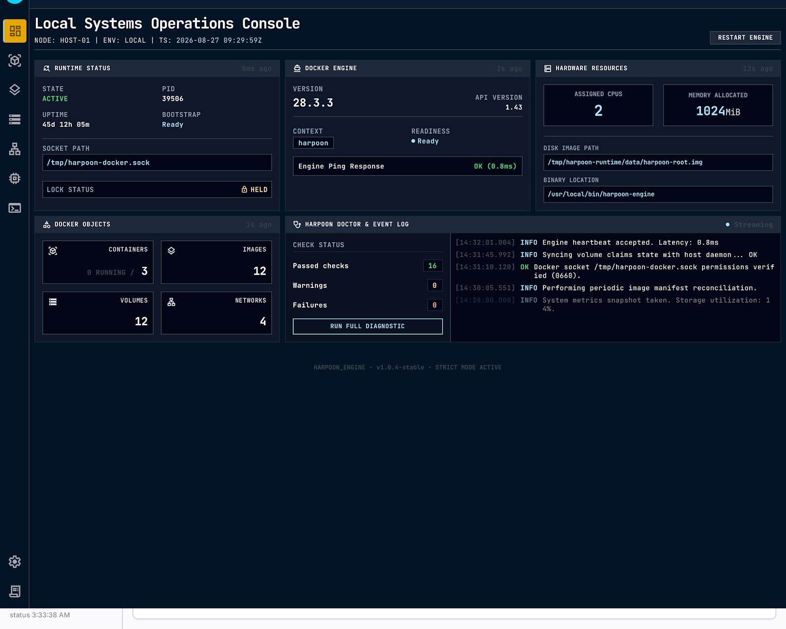
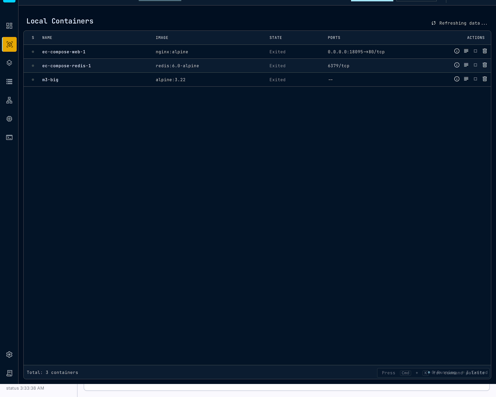
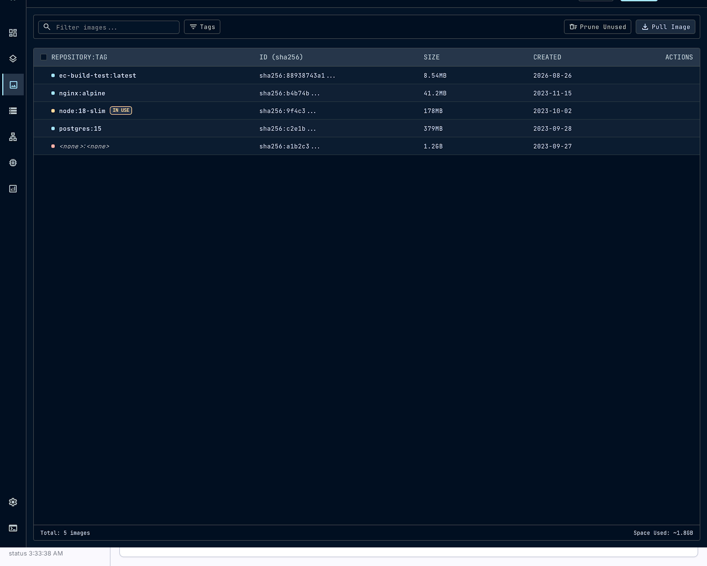

# Harpoon

Lightweight Docker-compatible container environment for macOS using Apple's Virtualization.framework and a minimal Linux VM.
[](https://github.com/krazybean/Harpoon/releases/latest)
[](https://github.com/krazybean/Harpoon/actions/workflows/codeql.yml)
[](https://securityscorecards.dev/viewer/?uri=github.com/krazybean/Harpoon)
[](https://github.com/krazybean/Harpoon/blob/main/LICENSE)
[](https://github.com/krazybean/Harpoon)


Harpoon runs ordinary Docker development workloads on macOS without requiring Docker Desktop. It provides the macOS-side virtualization substrate needed to run a standard Linux container stack while preserving compatibility with the Docker CLI, Compose, and surrounding tooling.

## Why Harpoon?

- **Native macOS integration** — built directly on `Virtualization.framework` (no bundled third-party hypervisor).
- **Docker-compatible workflow and API** where actually supported — `docker`, `compose`, and related tools speak to Harpoon's API through a standard Unix socket / Docker context.
- **Deliberately small architecture** — minimal Linux appliance guest, host control plane focused on VM lifecycle, socket bridging, networking, bind-mount transport, and diagnostics.
- **Transparent and inspectable** — source available, documented build from Swift and Tauri, no hidden updater or launch agent.

Harpoon does not replace Docker Engine. Docker Engine, containerd, and BuildKit remain authoritative inside the guest for containers, images, volumes, networks, and builds. Harpoon owns the macOS↔Linux boundary.

## Download Harpoon v0.1.0

macOS Apple Silicon:

- **Desktop + CLI:** [GitHub Releases](https://github.com/krazybean/Harpoon/releases) → `Harpoon-0.1.0-arm64.dmg`
- **CLI/runtime:** [GitHub Releases](https://github.com/krazybean/Harpoon/releases) → `harpoon-0.1.0-darwin-arm64.tar.gz` + `SHA256SUMS` (checksums)

Source builds remain available for contributors: `bash harpoon/build.sh` (see [Building](docs/building.md)). If a release asset URL is not yet published, use the Releases page linked above.

## Screenshots / Desktop UI

The Tauri/React desktop app is a client of the Harpoon runtime. Seven curated views are included under `docs/ui`:





Additional views: volumes, networks, resources, diagnostics. See [UI documentation](docs/ui/README.md) for visual-language notes (reference images are not specifications for runtime behavior).

## Current Capabilities

All items below have been demonstrated on the documented test system (see results). Fresh-start DNS validation has now passed — see below.

- **CLI & lifecycle:** `harpoon start` / `stop` / `restart` / `status` / `logs` / `run` / `version` / `help`; background lifecycle via `Process`, single instance via `flock` on `/tmp/harpoon.lock`, PID safety via `proc_pidpath`, stale recovery, terminal independence.
- **Docker integration:** socket at `unix:///tmp/harpoon-docker.sock` (`0600`), Docker context `harpoon` (`harpoon docker setup|status|use`), `docker --context harpoon version/ps/run/build/buildx` works without TCP.
- **Compose & dev workflow:** `compose build/up/down`, bind mounts (`ro` enforcement, named volume `pgdata` persistence), bridge `m9net` + DNS, published ports, `env`/`.env`/`healthcheck`/`scale`/`mem_limit`.
- **Networking:** VZNAT + virtio-net, host loopback forwarder for published ports (`docker run -p 8080:80` → `curl 127.0.0.1:8080`), `/tmp/harpoon-share` VirtioFS bind mounts, `net.ipv4.ip_forward=1`.
- **Installation / distribution:** relocatable `dist/harpoon-0.1.0-darwin-arm64` (bin 802K, kernel 33M, initramfs 14M, root 2G sparse), `harpoon/install.sh` to `/usr/local`, `uninstall.sh`, APFS clone-aware `cp -c` provisioning, ad-hoc signing with `com.apple.security.virtualization`.
- **Desktop app:** Tauri 2 + React + Vite (185 kB `dist`), 7 views, `status --json` live polling, per-action busy states, bootstrap `launching→ready/failed` with `Retry`, resource/config views backed by CLI.
- **Ecosystem compatibility:** matrix A–H via `harpoon/ec-test.sh` (when host healthy) — compose, contexts, buildx verified; specific matrix rows preserved as `BLOCKED` only by host transient, not product.
- **Validation:** dense acceptance harnesses (M7–M18, EC, UI, D1/D1.1) with logs, `tier-status.csv`, and preserved historical evidence.

Fresh-start DNS validation (clean stop → fresh `harpoon start` → Docker Engine 28.3.3 `linux/arm64` ready → guest `resolv.conf` with working external resolvers → `registry-1.docker.io` resolved → uncached `busybox:1.37` pull succeeded) **now passes**, superseding earlier documentation that described it as pending due to a Virtualization.framework host condition.

## Architecture

Conceptual data flow:

```
Docker CLI / client
        |
Harpoon host socket/API  (unix:///tmp/harpoon-docker.sock → vsock:2375)
        |
macOS Harpoon runtime (harpoon/Sources — Swift, Virtualization.framework)
        |
Virtualization.framework (VZVirtualMachine, VZLinuxBootLoader, VZNAT, VirtioFS, vsock)
        |
Linux VM (Alpine 3.22, Docker Engine 28.3.3, containerd)
        |
Docker Engine / container runtime
```

Harpoon's control plane is deliberately small. Container execution, image management, and orchestration remain inside the Linux VM under Docker Engine.

For component boundaries and transport details, see [Architecture](docs/architecture.md) and [Lifecycle](docs/lifecycle.md).

## Requirements

- macOS on Apple Silicon, Xcode Command Line Tools, Rust stable (for building)
- **Docker CLI required**, Docker Desktop **NOT required**. Docker Compose v2 plugin (`docker compose version`) required only for `compose` workflows. Harpoon discovers Docker via `PATH` → `/opt/homebrew/bin/docker` → `/usr/local/bin/docker` (Finder-safe) and creates/repairs context `harpoon` → `unix:///tmp/harpoon-docker.sock` without changing your default context (`harpoon docker setup`; desktop ensures on first use). If `~/.docker/config.json` contains `"credsStore":"desktop"` without `docker-credential-desktop`, `harpoon doctor` warns (Harpoon never deletes `credsStore`).
- **Persistent storage**: immutable `assets/guest/harpoon-root.img` template (`2 GiB` sparse, `0/0/0`) → mutable `~/Library/.../harpoon-root.img` (grow-only sparse, never silently replaced). First provision **8 GiB** logical (`azure-sql-edge` exhausted 2G) via `harpoon start --disk-size 16G` or `harpoon config set disk-size`; grow via `harpoon disk resize 16G` (VM stopped, `truncate` + guest `resize2fs`, atomic, `backing>FS` retry).

## Quick Start

Shortest verified path (see [Building](docs/building.md) for prerequisites, packaging, signing, and troubleshooting):

```sh
# Prerequisites: macOS on Apple Silicon, Xcode Command Line Tools, Rust stable
git clone https://github.com/krazybean/Harpoon.git
cd Harpoon

# Build runtime
bash harpoon/build.sh

# Start Harpoon (defaults: cpus 2, memory 1024)
harpoon/build/harpoon start
harpoon/build/harpoon status
harpoon/build/harpoon docker setup

# Use Docker through Harpoon
docker --context harpoon version
docker --context harpoon run --rm hello-world
docker --context harpoon run --rm alpine:3.22 true

# Stop when done
harpoon/build/harpoon stop
```

After `harpoon/install.sh`, the same commands are available as `harpoon start/stop/status/...` from any directory and without a checkout. Detailed prerequisites and release packaging (Tauri app, DMG) are in [Building Harpoon](docs/building.md).

## Desktop Application

`ui/harpoon-desktop` is a Tauri 2 + React + TypeScript + Vite app. It is a client of the Harpoon control API (`status --json`, `doctor`, `logs`, `config`) and never owns the VM lifecycle.

Currently implemented views: overview, containers, images, volumes, networks, resources, diagnostics. Features include 750 ms bootstrap polling, 3 s periodic polling throttled when hidden, async `counts_cache` coalescing, binary resolver (`HARPOON_BIN` → bundled → `harpoon/build/harpoon` → `/usr/local/bin/harpoon`), and Docker resource counts via the Harpoon socket.

Build in development:

```sh
cd ui/harpoon-desktop
npm ci
npm run tauri dev
```

See [Building](docs/building.md) for release builds (`npm run build:release`).

## Resource Usage / Validation

Representative measurements from the documented test system (Mac15,6 M3 Pro, 18 GiB, macOS 26.5.2, Docker 28.3.3) — observations, not guarantees:

- **Host control plane at idle (30 s, 15 samples):** runtime daemon ~12 MiB RSS, desktop UI ~69–71 MiB RSS, combined ~80–83 MiB. Apple Virtualization.framework XPC service ~86–100 MiB observed separately. See README's earlier “Benchmark note” for full methodology.
- **Earlier feasibility comparison (different methodology, not interchangeable):** Harpoon VM ~386 MiB idle vs Docker Desktop ~954 MiB; under nginx+Redis+Postgres workload Harpoon ~919 MiB vs ~1.76 GiB.

Guest/container memory depends on workload and is not inferable from XPC RSS alone.

Collected evidence under `docs/results` and `harpoon/results` (M13–M18, R1, EC, UI, D1/D1.1) with `tier-status.csv`, `host.csv`, logs, and preserved healthy vs `HOST_VZ_START_FAILURE` windows.

Links: [Performance](docs/performance.md), [Resources](docs/resources.md), [Validation results](docs/results/), [Architecture](docs/architecture.md).

## Security & Trust

Harpoon intentionally exposes inspectable signals rather than claiming security:

- Source available for inspection
- [Security policy](SECURITY.md) with responsible disclosure via GitHub Private Vulnerability Reporting
- [Contributing guide](CONTRIBUTING.md)
- Dependency graph enabled, Dependabot alerts (including malware alerts) and security updates enabled
- Dependabot configuration for `npm`, `cargo`, and `github-actions`
- Repository configuration for **CodeQL** (javascript-typescript, rust with `build-mode: none`, swift with manual `swiftc` build on `macos-latest`) and **OpenSSF Scorecard** (`v2.4.4`, pinned Actions)
- Pinned GitHub Actions (`actions/checkout`, `github/codeql-action/*`, `ossf/scorecard-action`, `actions/upload-artifact`) to commit SHAs

Harpoon includes repository configuration for CodeQL (javascript-typescript, rust, swift) and OpenSSF Scorecard. The repository is now public.

Results become publicly inspectable only after those workflows have completed successfully on the public repository. No successful CodeQL or Scorecard run is claimed here. Dependabot is active, dependency remediation has been performed, and one known transitive glib advisory remains monitored.

Automated analysis does not establish that Harpoon is safe, malware-free, or vulnerability-free. See [SECURITY.md](SECURITY.md) for scope, boundaries, and reporting.

## Known Limitations / v0.1 Scope

- **Platform:** macOS on Apple Silicon only; ARM64 Linux guests; no Intel or cross-platform claim.
- **Occasional VM startup condition:** An occasional host-side Virtualization.framework VM startup condition has been observed and characterized (see `docs/results/R1.md` for detailed evidence). The same build has been observed to start successfully; the condition is attributed to host/Virtualization.framework state rather than Harpoon packaging. Startup retries are bounded.
- **Distribution signing:** local ad-hoc signing with `com.apple.security.virtualization` (`codesign --verify --deep --strict` passes). Developer ID signing and Apple notarization are not complete for public Gatekeeper distribution.
- **Updates:** currently planned after a fresh build and restart; live reconfigure is not claimed.
- **Disk:** 2 GiB fixed sparse `harpoon-root.img` (APFS clone-aware, no growable resize in v0.1). Bounded at ~962 MiB–1.0 GiB allocated; `growable` was rejected intentionally.
- **Network/FS:** explicit `127.0.0.1` HostIp binding deferred ( `0.0.0.0` → `127.0.0.1` is the safe default); `inotify` host→guest not propagated (documented).
- **Memory reclamation:** virtiomem balloon device and guest driver present, but host-visible reclamation was not consistently demonstrated across the measured tiers; v0.1 does not market balloon as a guaranteed host RSS reduction.
- **Sandbox on this dev host:** `~/Library/Application Support/Harpoon/data` creation is blocked by the host sandbox (`Operation not permitted`); production uses that path, with fallback to `/tmp/harpoon-runtime/data` for tests. Also, no universal performance guarantee beyond the observed environment.

## Documentation

| Document | Purpose |
|---|---|
| [Building](docs/building.md) | Canonical build, packaging, signing, verification |
| [Security Policy](SECURITY.md) | Supported versions, disclosure process |
| [Contributing](CONTRIBUTING.md) | Bugs, PRs, build reference |
| [Roadmap](docs/roadmap.md) | Milestones and current position |
| [Architecture](docs/architecture.md) | Components, boundaries, data flows |
| [Results](docs/results/) | Validation evidence (M13–M18, R1, D1) |
| [Resources](docs/resources.md) | Resource usage and diet limits |
| [UI](docs/ui/README.md) | Screenshots and visual-language notes |

## Status

Harpoon v0.1.0 is the first public release.

Artifacts are published on the repository Releases page. Source builds remain supported via `bash harpoon/build.sh` (see [Building](docs/building.md)).

## License

MIT — see [LICENSE](LICENSE).
